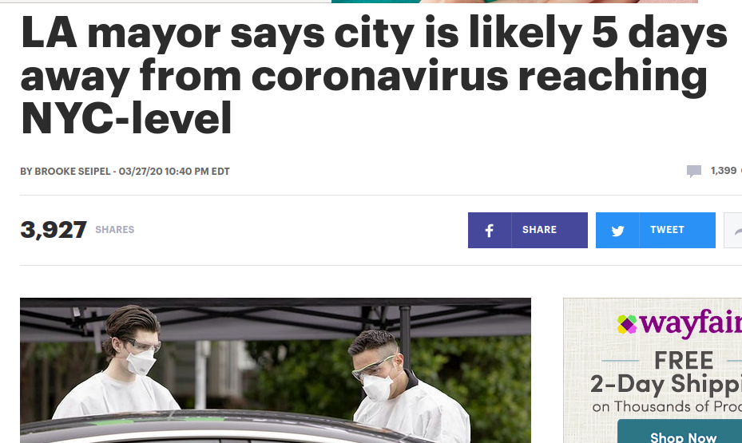

# **A Quick Look on COVID-19 Situation of the US and Your Neighborhood**
-----------------------

# Table of Contents
[1. Motivation](#motivation)  
[2. Data](#DATA)  
>   [2.1. Data Stucture](#DATA) 
>   [2.2. Data Acquisition](#Dataacquisition) 
    
[3. EDA](#EDA)
> [3.1. COVID Case](#case) 
> [3.2. COVID Test](#test) 
> [3.3. States](#states) 

[4. MAP](#Map)
> [3.1. US Map](#Map) 
> [3.2. LA Map](#LAMap) 

[5. Conclusion](#HT)

[6. Summary](#sm)

[7. Appendix](#Appendix)

-----------------------
# Motivation

## Background

> **"The death of one man is a tragedy. The death of millions is a statistic."**    - Original by Kurt Tucholsky as a Joke

On Apr 4th, 2020, there are more than 1 **million** COVID19 cases worldwide and more than 300,000 cases in the US and keep surging. 2/3 of Americans were under lockdown. 

On one side, people don't know what happens around their neighborhood. On the other side, politicians have been making conflict and chaos statements about the situation. 

The rationale behind this project is that we want to awake people before they are getting numb with the situation. As a future Data Scientist, what can we do to help people?

Providing **relevant and precise** information to people.

## Goal

There are two main objectives of this project, one is to provide an easy access method for people getting correct information about their neighborhood. 

The second is to test one of the scary statements made by Mayor of Los Angeles that LA was 5 days behind NYC on a few days ago.

What's more, we will try exploring what can we learned from South Korea which is treated as the most successful country in controlling the COVID-19.

----------------

# DATA

## Where do we get data?

One of the barriers of people getting the information they need is various information sources. We chose the most creditable and widely cited data source from Johns Hopkins. Additionally, we will webstrap text content from press releases and transform them into the data we need.

**Source** See [Appendix - Data Source](#DataSource)

## Data Structure

We obtain two types of data representing the COVID-19 situation.
* **Test Data**

    * Date
    * Country (Only for US and Korea)
    * States (Only for the US)
    * Number of Test Perform
    * Number of Test Positive
    * Number of Test Negative    
    
    
* **Case Data**

    * Date
    * Country 
    * States (Only for the US)
    * Community (Only for LA County)
    * Number of Confirmed Case
    * Number of Death Case
    * Number of Recovered Case   
    * Number of Active Case   
    
Jump to [EDA](#EDA) if you are not interested in web scraping and data cleaning.

## Data acquisition

Besides the data were well organized and available for download, one most important technique for obtaining data is **web scraping**.
### Web Scraping
Here is a demonstration of web scraping for sample page of a press release of the Department of Public Health of Los Angeles County.
> 

Every page would generate one single record through web scraping. We could obtain the Date of a single record from the top left of the page. 
> 
From the bottom, we could get confirmed cases and its infective density for each community in LA county.
The process is implemented by a pre-define webscrap class `webscrape` including functions for getting tables, get text and get URLs. The class definition is stored as `./src/web_scraping`.
Sample data as below.

| city | April 08, 2020 | 
|--------------------------|----|
| City of Agoura Hills     | 19 | 
| City of Alhambra	     | 26 | 	
| City of Arcadia     | 17 | 			

### Pipeline

Before merge everyday data, we need to double-check data on consistency. Figure out some data built on inconsistent city names.

| city | March 26, 2020 | 
|--------------------------|----|
| Agoura Hills     | 5 | 
| Alhambra	     | 8 | 	
| Arcadia     | 6 | 			

We create rules to transform city name in a same scale and merge into a ready dataset.

| city | April 08, 2020 | April 07, 2020 | April 06, 2020 | ... | March 26, 2020 |... |
|--------------------------|-------|-------|-------|-------|-------|------|
| City of Agoura Hills     | 19 |  19 | 18 | ... | 5 |... |
| City of Alhambra	     | 26 |  24 | 22 | ... | 8 |  ... | 				
| City of Arcadia     | 17 |  17 | 16 | ... | 6 |... | 		

------------------------

# EDA

-------------------
## EDA on Case Data

There are two types of case data, one is cross-section data describe a single day all kinds of records of different areas. The other one is a panel data focused on one attribute of a different area over time.

### Cross-section data

First, we take a look at the schema of the dataset.

|  #  | Column        |  Non-Null | Count | Dtype  | 
| --- |  ------        |   --------| ------ |  -----  | 
| 0  | FIPS           | 2603 | non-null |  float64| 
| 1  | Admin2         | 2614 | non-null |  object | 
| 2  | Province_State | 2703 | non-null |  object | 
| 3  | Country_Region | 2883 | non-null |  object | 
| 4  | Last_Update    | 2883 | non-null |  object | 
| 5  | Lat            | 2823 | non-null |  float64 | 
| 6  | Long_          | 2823 | non-null |  float64 | 
| 7  | Confirmed      | 2883 | non-null |  int64  | 
| 8  | Deaths         | 2883 | non-null |  int64  | 
| 9  | Recovered      | 2883 | non-null |  int64  | 
| 10 | Active         | 2883 | non-null |  int64  |
| 11 | Combined_Key   | 2883 | non-null |  object | 

The variables we most care about are `Confirmed, Deaths, Recovered, Active` 4 columns. 

Hence, we will explore the inner relationship among them through a pairwise scatter plot through `seaborn`.

As we can see from the plots, **all the death, recovered and active case has a positive relationship on the confirmed case.** So if we want to see a small number in death, we need to see a low level of confirmed cases.

----------------

### Panel Data

First, We take a look at the schema of panel data.

|  #  | Column        |  Non-Null | Count | Dtype  | 
| --- |  ------        |   --------| ------ |  -----  | 
| 0  | Province/State | 82 | non-null |  object | 
| 1  | Country_Region | 263 | non-null |  object | 
| 2  | Lat            | 263 | non-null |  float64 | 
| 3  | Long          | 263 | non-null |  float64 | 
| 4  | 1/22/20 | 263 | non-null |  int64 | 
| ...  | ...    | 263 | non-null |  int64 | 
| 81  | 4/8/20    | 263 | non-null |  int64 | 

For time-series data, the trend is much more important. As we can see below, **the increasing trend of confirmed cases has been accelerating since Early March** without a clear sign for slowing down.

The recent growth of confirmed cases was contributed by US and West Euro countries. And the US has shown the most worrying sign in terms of the most case without a slowing downtrend.

Another takeaway from this plot, there are two countries, China and South Korea were considered well controlled the COVID-19 while South Korea's example was repeatable which means massive tests, quick tracking, and quarantine.

Next step, we will try to explore the relationship between Korean testing and cases.

----------------

## EDA on Tesing Data

Let's take a flight to Seoul CDC and robbed their press release drafts and type into our computer.

As usual, we first check on the data structure.

|  #  | Column        |  Non-Null | Count | Dtype  | 
| --- |  ------        |   --------| ------ |  -----  | 
| 0  | Total | 59 | non-null |  int64 | 
| 1  | PCR_Confirmed | 59 | non-null |  int64 | 
| 2  | PCR_Discharged            | 59 | non-null |  int64 | 
| 3  | PCR_Isolated          | 59 | non-null |  int64 | 
| 4  | PCR_Deceased | 59 | non-null |  int64 | 
| 5  | Being_tested | 59 | non-null |  int64 | 
| 6  | Tested_negative | 59 | non-null |  int64 | 

The `PCR_Confirmed` means the number of patients tested positive on the coronavirus through the PCR method which is equivalent to the confirmed case we talked before.

Since all variables were on an accumulated scale, we made a differentiate of the data on a one day lag. For instance, `new_testing` 

$$new testing(Day n)  =  Total(Day n)  -  Total(Day n - 1)$$

and calculate the positive_rate by

$$positive rate(Day n)  =  \frac{PCR Confirmed(Day n)}{new testing(Day n)}$$

We use a similar method as before that creating a pairwise scatter plot.

We did not observe a clear pattern between `new_testing` and `positive_rate`. 

----------------

## Back to US

Let travel back to Los Angeles, California, US on a time which seems not a good time for international travel.

Although California has the most population among the states, California is not even the top 3 and has a relative flatten the curve.

However, states are too large for us to perceive how are things going around. Also, the best way to present geographical data is always, maps.

----------------

# Map

----------------

## US Map
Since the case data includes geographic information, we could plot all the points onto a map by `folium` library.

* Radius: Larger indicates a larger number of case

* Color: Sharper color indicates a larger number of case

We could easily identify some epicenter of the US, most serious in NY, and then Florida and California.

To show more, we integrate a line chart showing the 7 days trend by using `altair` library and passing `JSON Graph` on the marker.

Link to [US MAP](US.html)

----------------

## LA Map

To learn more about local, we want a map on the community level. However, [the community level data](#communitylevel) that we web-scraped were not integrated with geographic information. Fortunately, we find the `GeoJSON` of the LA community file from data.gov.

In this case, we use **choropleth map** to present the boundaries in the communities and also cluster the marker to show some clearer. In the following map, the color shows the infective density which is calculated by the number of confirmed cases per 100,000 population.

We can tell that WeHo and BH have the most difficult situation in LA.

Similarly, we provide community-related information on the marker. 

Link to [LA MAP](LA2.html)

----------------

# Hypotheses Test

Another reason people getting numb with this situation is that politicians sometimes governors making overstated or downplaying statements that confused a lot of people.

One scary story was told by LA Mayor Eric Garcetti.

> 

We will exam his hypotheses through a **Hypotheses test**.

To be more specific, we rewrite his statement as the null hypothesis.

> Null hypothesis H0: From now till Apr 1st (5 days after) LA county has the same case level or even higher than NYC from Mar 23rd to Mar 27th. 

> Alternative hypothesis H1: From now till Apr 1st (5 days after) LA county has less case level than NYC from Mar 23rd to Mar 27th. 

For such small sample size, the best option right now is Mann-Whitney U test. Mathmatically,

>$$H_0 = P(NY case > LA case)=0.5$$
>$$H_1 = P(NY case > LA case)>0.5$$

By `scipy.stats` module, we could easily calculate the P-value and see the original statement is valid or not on significance level 0.05.

> The P-value of the U-test is 0.006. 
We **reject the null hypotheses** on significance level 0.05.

It would be seen in another way of plotting.

NYC cases were much serious in terms of quantity and growth rate.

----------------

# Summary

----------------

## Takeaway

### From data

* US is still currently the epicenter of COVID-19 and cases are still growing fast.
* CA is one of the epicenter inside the US. The situation in LA showing no trend to be the second New York but it is still too early to be optimized.
* Be suspicious on the guess or projection from the authority. DO your own research.

### Technically:

* The U test has an assumption on the sample from i.i.d. while we did not have time to test it. The Chow's test on time series might be a good try if time allows.
* Constructing a reusable class is fun. In my case, web scraping class helps a lot and see a potential for future usage.
* While playing with web scraping or Geo plotting, some basic HTML knowledge could save a lot of work.

### Projects:

* A plan is crucial to success. Although I much underestimated the workload of the project, I am still able to present my work completed in time.
* Workload estimation should be performed before getting started. Although I finished work in time, I did too much overtime on it which might somehow affect the quality.

## **Real takeaway for you!!**

* Stay at home.
* Wear a mask and bring a hand sanitizer if you must go out.
* Avoid close contact.

Most important:

**Share information with people you love. Talk to people who ever share their love with you.**

Learn more about data science.

> **"It is only tiny dust of this era, but to an ordinary family, is too much they can take."**

> From a Chinese Poet lives in Wuhan the original epicenter in China.

Don't let the one you loved be the dust of the era.

# Appendix

**Data Source**

- **Getting CSSE data on github**

    source: https://github.com/CSSEGISandData/COVID-19 by Johns Hopkins CSSE

- **Gather state testing data thru API**

    source: https://covidtracking.com/data 
    - US Testing in Time Series https://covidtracking.com/api/us/daily.csv
    - States Historical Data https://covidtracking.com/api/states/daily.csv

- **Webscrap Korean testing data**

    Source: CDC of South Korean
    - sample data https://www.cdc.go.kr/board/board.es?mid=&bid=0030&act=view&list_no=366735
    
    
- **Webscrap LA community-level data**

    Source: The Department of Public Health of Los Angeles County
    - sample data http://publichealth.lacounty.gov/phcommon/public/media/mediapubhpdetail.cfm?prid=2298
    
    
- **GeoJSON of LA community**

    Source: Data.gov
    https://catalog.data.gov/harvest/los-angeles-data-json
---------------------------------

**GitHub Links**

* Repository: https://github.com/constiny/COVID19

* Jupyter Notebook: https://github.com/constiny/COVID19/blob/master/covid19.ipynb

